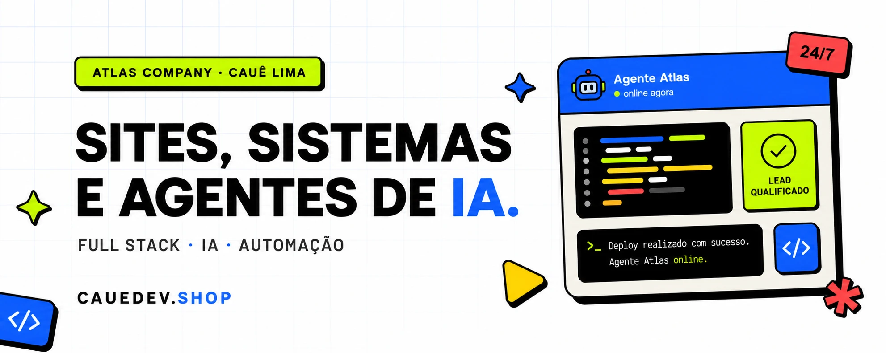

**Sites, sistemas e agentes de IA — do schema ao domínio no ar.**

Modelagem de dados, API, interface e deploy. A maior parte do que construí está em produção hoje,
atendendo usuário real: saúde suplementar, CRM e captação de leads.

---

## 🧱 Stack

ETL em Node sobre datasets públicos, modelagem e RPCs em Postgres, multi-tenancy com Row Level Security.
Também Meta Ads e mensuração — construo o funil e leio o resultado dele.

---

## 🚀 Em produção

| Produto | O que é | Stack | Código |
|---|---|---|---|
| [**Pront.**](https://pront-saude-digital.netlify.app) | SaaS multi-tenant de saúde digital: prontuário eletrônico, agenda e gestão de clínicas, com isolamento por clínica via Row Level Security | Next.js 14 · TypeScript · Supabase | [público](https://github.com/cauelimsia/pront-saude-digital) |
| [**Rede Certa**](https://top-prime-rede.vercel.app) | Consulta de rede hospitalar por plano de saúde. ETL próprio sobre os dados abertos da ANS: ~40M de vínculos reduzidos a uma base consultável de ~66 mil planos e ~33 mil hospitais | Next.js 16 · Postgres · ETL em Node | privado |
| [**Top Prime Seguros**](https://topprimeseguros.com.br) | Site de captação de leads com atribuição de ponta a ponta e conformidade LGPD/Google Ads | Next.js · Supabase | privado |
| [**Cotador**](https://top-prime-cotador.vercel.app) | Gerador de cotações de plano de saúde em PDF, com múltiplos temas de marca | Next.js · Supabase | privado |
| [**DNIA**](https://dnia-site.vercel.app) | Site de produto para agente de IA em WhatsApp, com animação em three.js e GSAP | Next.js 16 · three.js · GSAP | privado |

---

## 📂 Repositórios públicos

| Repo | O que tem de interessante |
|---|---|
| **[surebet-api](https://github.com/cauelimsia/surebet-api)** | Motor de arbitragem esportiva como função pura, worker que reconcilia estado em vez de acumular, e o detalhe de agrupamento de linha assinada que separa arbitragem real de fantasma. Monorepo pnpm com Vitest |
| **[pront-saude-digital](https://github.com/cauelimsia/pront-saude-digital)** | Multi-tenancy real: o isolamento entre clínicas está nas policies do Postgres, não na aplicação |
| **[redecorr-apresentacao](https://github.com/cauelimsia/redecorr-apresentacao)** | Deck em WebGL — uma nuvem de 2.800 partículas em three.js que muda de formação conforme a narrativa, com modo apresentador. JavaScript puro |
| **[plano-a-apresentacao](https://github.com/cauelimsia/plano-a-apresentacao)** | Engine de slides própria onde o conteúdo é dado: `index.html` tem 44 linhas, o resto é derivado |
| **[presentations](https://github.com/cauelimsia/presentations)** | Mesma engine, agora data-driven em ES modules |
| **[til](https://github.com/cauelimsia/til)** | TIL — notas curtas do que aprendo no dia a dia: Next.js, Supabase, Postgres, PowerShell, Git |

> Boa parte do que trabalho é código de cliente e fica em repositório privado.
> Os links da tabela **Em produção** levam ao produto no ar, que é onde dá para ver o resultado.

---

## 🌱 Open source

- [darkroomengineering/lenis#539](https://github.com/darkroomengineering/lenis/pull/539) — correção na documentação da propriedade `direction` do smooth scroll

---

## 📈 Atividade

<picture>
  <source media="(prefers-color-scheme: dark)" srcset="https://raw.githubusercontent.com/cauelimsia/cauelimsia/output/langs-dark.svg">
  
</picture>

<picture>
  <source media="(prefers-color-scheme: dark)" srcset="https://raw.githubusercontent.com/cauelimsia/cauelimsia/output/snake-dark.svg">
  
</picture>

